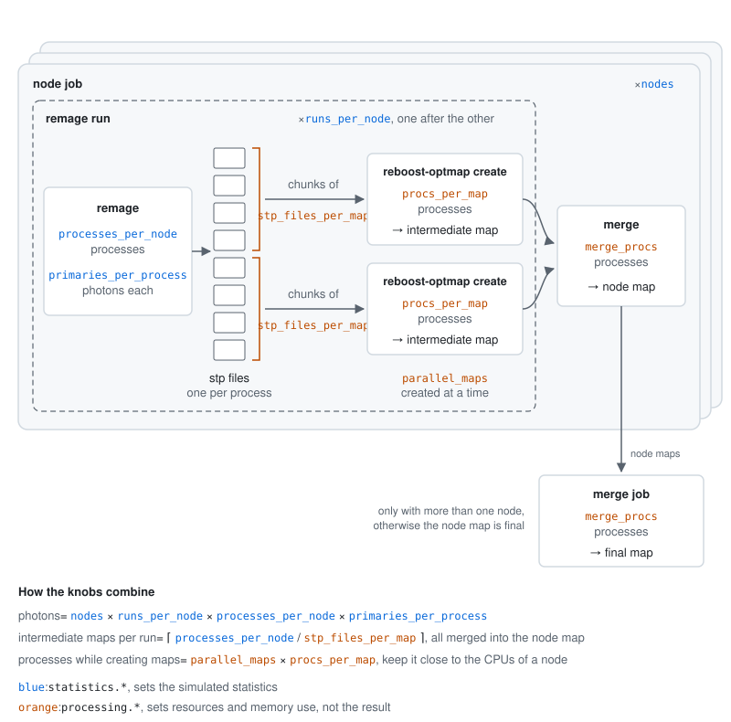

# Configuration

The configuration is a YAML or JSON file. Relative paths are relative to the
directory of the configuration file, and `$_` in any value is replaced by that
directory. A complete example, equivalent to the former `workflow.sb` but on 4
nodes, is in
[`examples/l200/optmap-l200cfg01.yaml`](https://github.com/legend-exp/optmapper/blob/main/examples/l200/optmap-l200cfg01.yaml):

```yaml
name: l200cfg01-lar-vuv
output_dir: optmap-l200cfg01

geometry:
  executable: legend-pygeom-l200
  config: geom-config.yaml
  env:
    LEGEND_METADATA: $_/legend-metadata

emission:
  gaussian: { mean: 9.68 eV, sigma: 0.22 eV }

statistics:
  nodes: 4
  runs_per_node: 5
  primaries_per_process: 8_000_000

optmap:
  volume: liquid_argon
  shape: cylinder
  range_in_m: [[-2, 2], [-2, 2], [-3, 3]]
  bins: [80, 80, 120]

execution:
  site: nersc
  slurm:
    node:
      mail-type: TIME_LIMIT,FAIL
      mail-user: someone@example.com
```

## `name`, `output_dir`

`name` is the production name, used for the output and job names. `output_dir`
is the output directory, on persistent storage.

## `geometry`

Official map productions should use a LEGEND geometry generator:

- `executable`: the generator, e.g. `legend-pygeom-l200` or
  `legend-pygeom-l1000`
- `config` (optional): geometry configuration, a file name or an inline mapping.
  In a file, `$_` is replaced by the directory of that file.
- `optics_plugin` (optional): Python file passed to the generator's
  `--pygeom-optics-plugin` option, to change optical properties. It is also
  applied when generating the `emission.spectrum`.
- `env` (optional): environment variables for the generator, e.g.
  `LEGEND_METADATA` (legend-pygeom-l200) or `LEGEND1000_METADATA`
  (legend-pygeom-l1000). Environment variables in the values are expanded.

`optmapper` runs the generator once, before submitting the jobs.

If the user wants, they can use a GDML file instead:

```yaml
geometry:
  gdml: my-geometry.gdml
```

## `emission`

The energy spectrum of the optical photons, one of:

- `spectrum`: the dotted path of a function with signature
  `f(filename, output_macro)` that writes a G4GeneralParticleSource spectrum,
  like `pygeomoptics.lar.g4gps_lar_emissions_spectrum`,
  `pygeomoptics.pen.g4gps_pen_emissions_spectrum` or
  `pygeomoptics.fibers.g4gps_fiber_emissions_spectrum`
- `g4gps_spectrum_macro`: a macro file written by such a function with
  `output_macro=True`, e.g. with a modified spectrum. Its `/gps/` commands are
  copied into the remage macro.
- `gaussian`: `mean` and `sigma`, as energies (`9.68 eV`) or, for the mean, as a
  wavelength (`128 nm`). Plain numbers are in eV.

## `statistics`

| key                     | default   | meaning                                       |
| ----------------------- | --------- | --------------------------------------------- |
| `nodes`                 | 1         | number of node jobs                           |
| `runs_per_node`         | 1         | remage runs per node job, one after the other |
| `primaries_per_process` | 1 000 000 | photons simulated by each remage process      |
| `processes_per_node`    | all CPUs  | remage processes per run (`remage --procs`)   |

The total number of photons is the product of the four values.

## `optmap`

| key                 | default        | meaning                                      |
| ------------------- | -------------- | -------------------------------------------- |
| `range_in_m`        | required       | `[[xmin, xmax], [ymin, ymax], [zmin, zmax]]` |
| `bins`              | required       | number of bins along x, y, z                 |
| `volume`            | `liquid_argon` | physical volume(s) to generate photons in    |
| `shape`             | `cylinder`     | `cylinder`, `box` or `none`                  |
| `inner_radius_in_m` | 0              | inner radius of the cylinder                 |
| `detectors`         | all            | detectors to make individual maps for        |

The map bounds also set the primary vertex confinement in the macro: photons are
generated in the intersection of `volume` with a box filling the map bounds
(`shape: box`) or with the cylinder inscribed in them (`shape: cylinder`,
requires equal x and y ranges). With `shape: none`, photons are generated in the
whole `volume`.

## `processing`

| key                 | default | meaning                                           |
| ------------------- | ------- | ------------------------------------------------- |
| `stp_files_per_map` | 32      | remage output files per intermediate map          |
| `parallel_maps`     | 8       | intermediate maps created at the same time        |
| `procs_per_map`     | 16      | processes used to create each intermediate map    |
| `merge_procs`       | 8       | processes used to merge maps                      |
| `bufsize`           | 50 000  | rows read at a time from the remage output files  |
| `keep_stp`          | false   | copy the remage output files to `output_dir/stp/` |

## `advanced`

- `pre_init_commands`: macro commands inserted before `/run/initialize`
- `commands`: macro commands inserted before `/run/beamOn`
- `template`: a custom macro template, see the
  [default template](https://github.com/legend-exp/optmapper/blob/main/src/optmapper/templates/optmap.mac)
  for the available placeholders
- `remage_args`: extra remage command line options, default
  `["--ignore-warnings"]`

## `execution`

| key           | meaning                                                            |
| ------------- | ------------------------------------------------------------------ |
| `site`        | site preset to start from (default `local`)                        |
| `scheduler`   | `slurm` or `local`                                                 |
| `scratch_dir` | fast temporary storage, default `output_dir/scratch`               |
| `launcher`    | command prefix to start the worker, default `pixi run --as-is ...` |
| `env`         | environment variables set in the worker                            |
| `slurm.node`  | `sbatch` options for the node jobs                                 |
| `slurm.merge` | `sbatch` options for the merge job                                 |

Environment variables in `scratch_dir` (like `$PSCRATCH`) are expanded on the
compute node. `sbatch` options are given without the leading `--`: `key: value`
becomes `--key=value`, `key: true` becomes `--key`, and `key: null` removes an
option set by the site preset.

## Illustration of statistics/processing options


